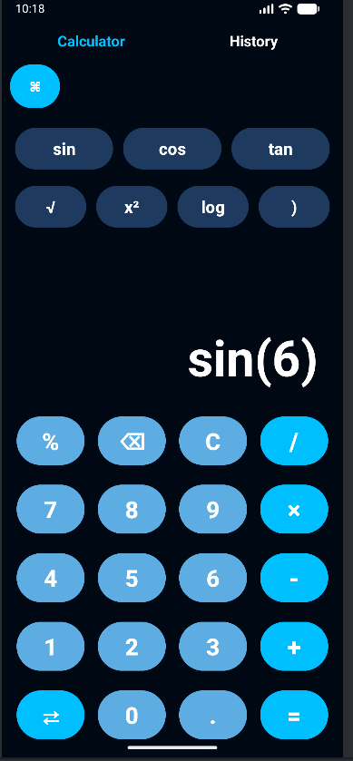

# Smart Calculator App

A modern Android Calculator App built using Kotlin and XML with a premium UI design and multiple smart features.

## Features

### Calculator
- Basic arithmetic operations
- Scientific calculations
- Percentage calculations
- Square root support
- Pi value support
- Responsive button layout

### Converter
- Length Converter
- Weight Converter
- Temperature Converter
- Currency Converter

### History
- Stores calculation history
- Stores conversion history
- Date and time tracking

### UI Design
- Modern black + sky blue theme
- Smooth responsive layout
- Material Design components
- Clean and beginner-friendly interface

## Technologies Used

- Kotlin
- XML
- Android Studio
- ViewBinding
- Material Components
- Gradle

## Screenshots

### Calculator Screen

### Operations Screen

### Converter Screen

### History Screen

## Project Purpose

This project was developed to improve Android development skills, UI designing, problem solving, and Kotlin programming knowledge.

## Developer

Sathwika Mamidipelli

## GitHub Repository

SmartCalculator-App
